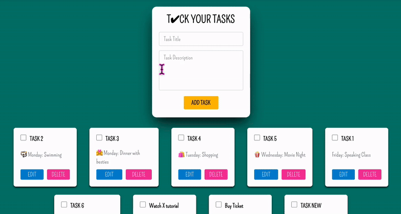

# Tick Tasks App

## ✔︎ Tick it off, keep it simple.

**Tick Tasks** is a modern full-stack Todo app built with the latest technologies like **Next.js**, **MongoDB**, **Zustand** and **Prisma ORM**.  
Designed to help you track your daily tasks with clarity and simplicity.

👉 **Live Demo:** https://next-tick-tasks.vercel.app/

### Demo



## Features

- Add, update, and delete tasks
- Track task descriptions & statuses
- Real-time toast notifications (React Toastify)
- Smooth state management (Zustand)
- Form validation with React Hook Form
- Clean UI with Tailwind CSS and DaisyUI
- MongoDB integration via Prisma ORM

## Tech Stack

- **Next.js**: `15.3.5`
- **React**: `^19.0.0`
- **React DOM**: `^19.0.0`
- **Tailwind CSS**: `^4`
- **DaisyUI**: `^5.0.43`
- **Zustand**: `^5.0.6`
- **Prisma**: `6.11.1`
- **@prisma/client**: `6.11.1`
- **MongoDB**: `^6.17.0`
- **Axios**: `^1.10.0`
- **React Hook Form**: `^7.60.0`
- **React Toastify**: `^11.0.5`
- **ESLint**: `^9`

## Installation & Setup

1. **Clone the Repository and Navigate to the Project Directory:**

   ```bash
   git clone https://github.com/zbaharyilmaz/fs-tick-tasks.git

   cd fs-tick-tasks
   ```

2. **Install Dependencies:**

   ```bash
   pnpm install
   ```

3. **Set up Environment Variables:**

   Create a `.env` file in your project root and add the following:

   ```env
   DATABASE_URL=mongodb+srv://<username>:<password>@<cluster>.mongodb.net/ticktasks?retryWrites=true&w=majority
   ```

4. **Set up Prisma:**

   Adds Prisma dependencies to your project, set up Prisma config files and environment variable template and generates Prisma client based on schema.prisma for database operations

   ```bash
   pnpm add prisma @prisma/client
   npx prisma init
   npx prisma generate
   ```

## Project Structure

```plaintext
    app/                → App Router pages and API routes
    components/         → UI components (AddTask, Modal, Task, TaskList)
    lib/                → Prisma client setup
    store/              → Zustand store (task state management)
    generated/          → Prisma generated client and runtime files
    prisma/             → Prisma schema file
    public/             → Static assets
    styles/             → Tailwind CSS and global styles (globals.css)
```

## Deployment

This project is deployed on Vercel for easy and fast hosting.

- Continuous deployment is configured via the GitHub repository.

- Every push to the main branch triggers an automatic build and deployment.
